# PARDUS-Control-Center

## Proje Tanımı

**PARDUS Control Center**, Linux sistemlerde servis yönetimini kolaylaştırmak amacıyla geliştirilmiş, **GUI (Graphical User Interface)** ve **TUI (Terminal User Interface)** destekli bir sistem yönetim aracıdır. Proje, özellikle **systemctl** tabanlı servislerin durumunu görüntüleme ve yönetme işlemlerini kullanıcı dostu bir arayüzle sunmayı hedefler.

---

## Projenin Amacı

* Linux servis yönetimini teknik bilgisi sınırlı kullanıcılar için erişilebilir hale getirmek
* Komut satırı araçlarına GUI ve TUI arayüzler kazandırmak
* `systemctl` kullanımını sadeleştirmek
* Aynı çekirdek (core) mantığıyla hem GUI hem TUI arayüz çalıştırabilmek

---

## Proje Mimarisi

Proje **3 ana bileşenden** oluşur:

```
proje/
├── core.sh   # İş mantığı (systemctl, journalctl işlemleri)
├── gui.sh    # YAD tabanlı grafik arayüz
├── tui.sh    # Dialog/Whiptail tabanlı terminal arayüzü
└── README.md
```

### core.sh

* Servis listeleme
* Servis durumu görüntüleme
* Servis başlatma / durdurma / yeniden başlatma
* Servis sağlık kontrolü

> core.sh, GUI ve TUI tarafından ortak kullanılır. Böylece **kod tekrarı önlenmiştir**.

---

## GUI (Graphical User Interface)

GUI, **YAD (Yet Another Dialog)** aracı kullanılarak geliştirilmiştir. Grafik arayüz, kullanıcıların servis yönetimini fare ve klavye yardımıyla kolayca yapabilmesini sağlar.

### GUI Genel Akış

1. Kullanıcı ana menü ile karşılaşır
2. Bir işlem seçer
3. Seçilen işleme ait yeni pencere açılır
4. İşlem tamamlandıktan sonra ana menüye geri dönülür

---

### GUI – Ana Menü

**Açıklama:**
Bu ekran, GUI uygulamasının giriş noktasıdır. Kullanıcı burada yapmak istediği servis yönetimi işlemini seçer.

**Menü Seçenekleri:**

* **Servisleri Listele:** Sistemde çalışan servisleri listeler
* **Servis Durumu Göster:** Belirli bir servisin detaylı durumunu gösterir
* **Servis Başlat:** Girilen servis adını başlatır
* **Servis Durdur:** Girilen servisi durdurur
* **Servis Yeniden Başlat:** Servisi yeniden başlatır
* **Servis Sağlık Kontrolü:** Servisin genel sağlık ve hata durumunu kontrol eder
* **Çıkış:** Uygulamadan çıkar

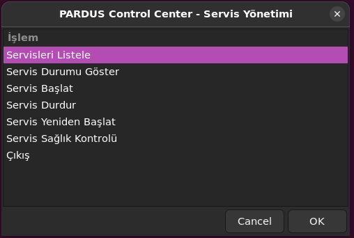

---

### GUI – Servisleri Listele

**Açıklama:**
Bu ekranda sistemde aktif olan servisler, yüklenme durumu ve çalışma bilgileri tablo halinde gösterilir.

**Gösterilen Bilgiler:**

* Servis adı
* Yüklenme durumu
* Çalışma durumu
* Alt durum bilgisi


---

### GUI – Servis Durumu Göster

**Açıklama:**
Kullanıcıdan bir servis adı alınır ve bu servise ait detaylı durum bilgisi görüntülenir.

**Gösterilen Bilgiler:**

* Servisin aktif/pasif durumu
* Çalışma süresi
* Son log mesajları

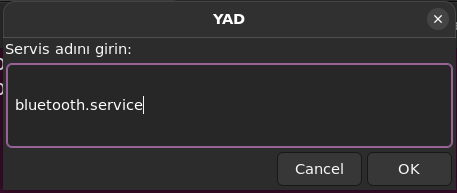
<br>
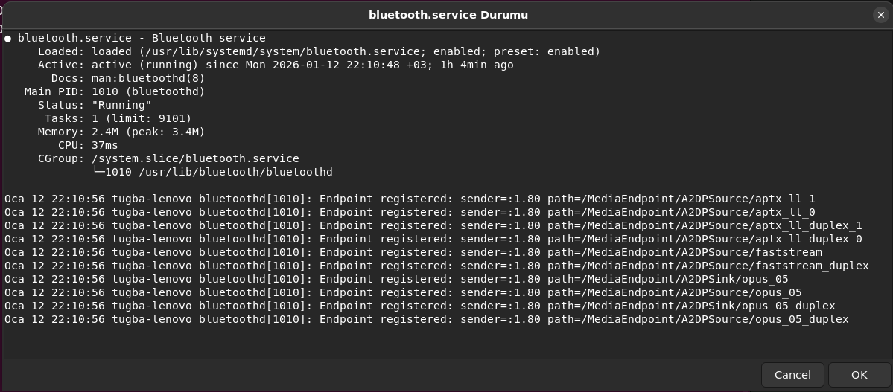


---

### GUI – Servis Başlat / Durdur / Yeniden Başlat

**Açıklama:**
Bu ekranlarda kullanıcıdan servis adı alınır ve seçilen işlem gerçekleştirilir.

**Örnek İşlemler:**

* ssh.service başlatma
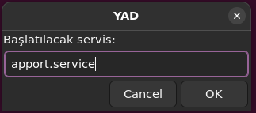
<br>
* apache2.service durdurma

<br>
* yeniden başaltma
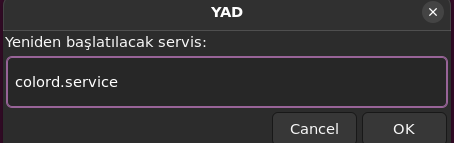

---

### GUI – Servis Sağlık Kontrolü

**Açıklama:**
Seçilen servisin hata durumu, başarısız başlatma denemeleri ve genel sağlık bilgisi gösterilir.

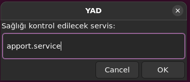
<br>
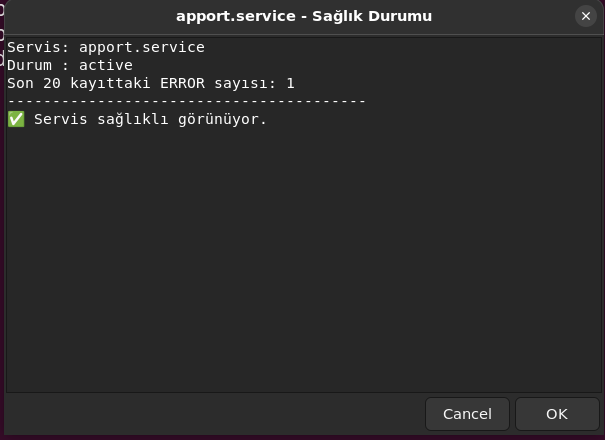


---

## TUI (Terminal User Interface)

TUI, terminal ortamında çalışan kullanıcılar için geliştirilmiş metin tabanlı bir arayüzdür. **dialog / whiptail** kullanılarak oluşturulmuştur.

### TUI Genel Akış

1. Terminal üzerinden uygulama başlatılır
2. Menü seçenekleri klavye ile seçilir
3. Seçilen işleme ait ekran açılır
4. İşlem sonrası ana menüye dönülür

---

### TUI – Ana Menü

**Açıklama:**
Bu ekran TUI uygulamasının başlangıç ekranıdır. Kullanıcı yön tuşları ve Enter ile seçim yapar.
Uygulama çalıştırıldığında aşağıdaki ana menü ekrana gelir:

* Servis Durum Tablosu
* Servis Loglarını Göster
* Cron Job Ekle
* Sistem Bilgisi
* Servis Sağlık Kontrolü
* Çıkış

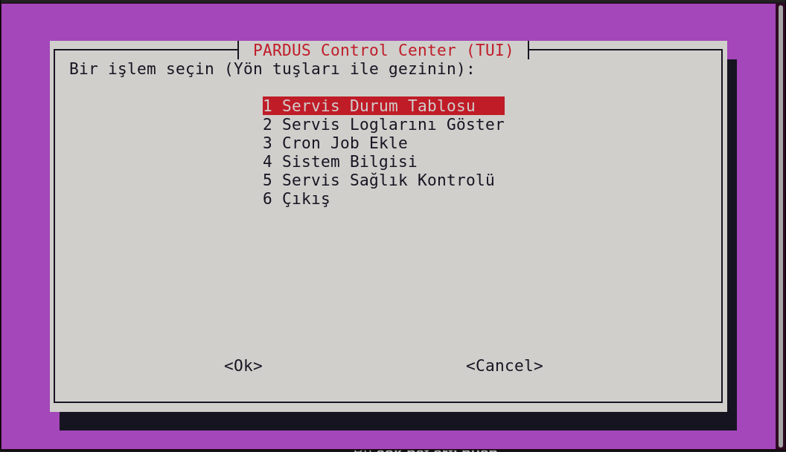
---

### TUI – Servis Durum Tablosu

**Açıklama:**
Bu seçenek, sistemdeki servislerin aktif / pasif / başarısız durumlarını tablo halinde gösterir.

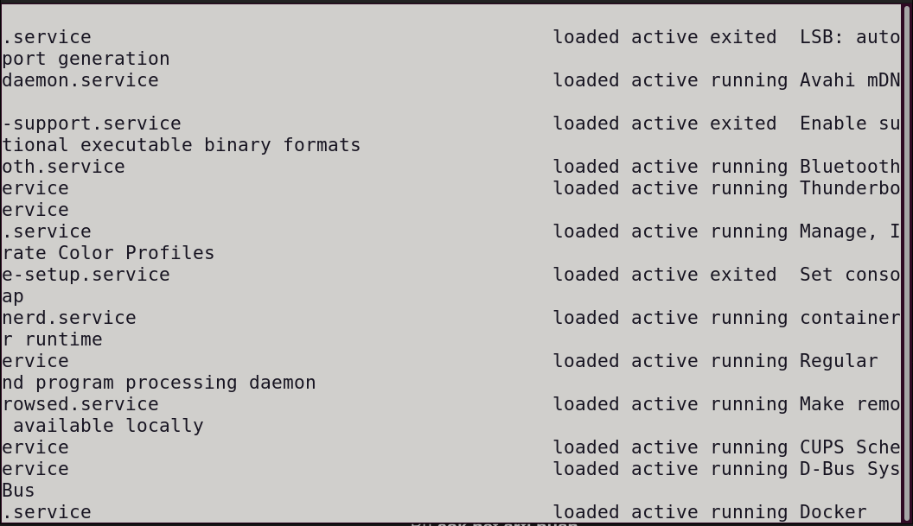
---

### TUI – Servis Loglarını Göster

**Açıklama:**
Kullanıcıdan bir servis adı alınır ve seçilen servise ait systemd logları ekranda görüntülenir.

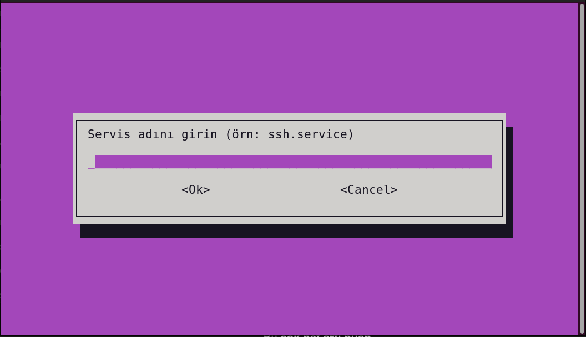
---

### TUI – Cron Job Ekle

**Açıklama:**
Bu bölümde kullanıcıdan zaman bilgisi ve çalıştırılacak komut alınarak cron job eklenir.

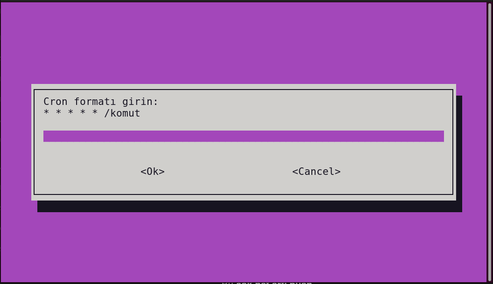
---

### TUI - Sistem Bİlgisi

**Açklama:**
Bu menü, sistem hakkında genel bilgileri gösterir:
* İşletim sistemi bilgisi
* Kernel sürümü
* CPU bilgisi
* RAM durumu
* Disk kullanımı

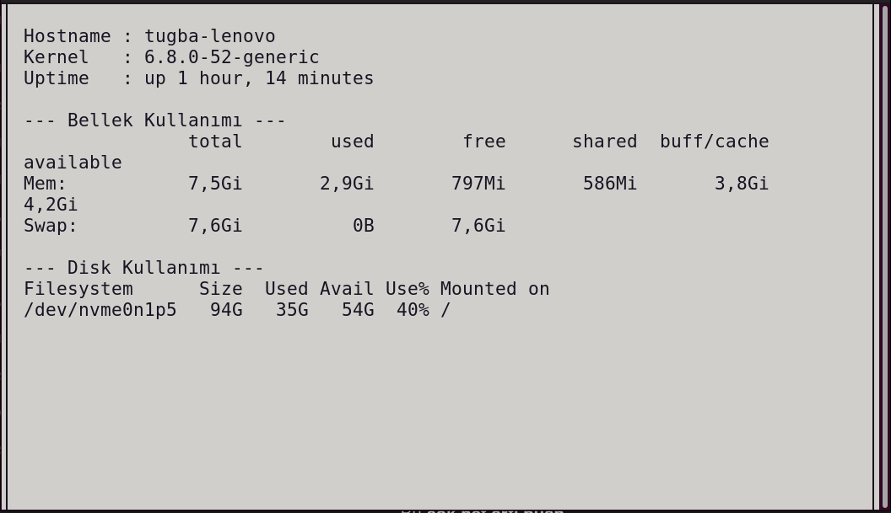

---
###  TUI – Servis Sağlık Kontrolü

**Açıklama:**
Servisin genel durumu ve olası hataları terminal arayüzü üzerinden incelenir.

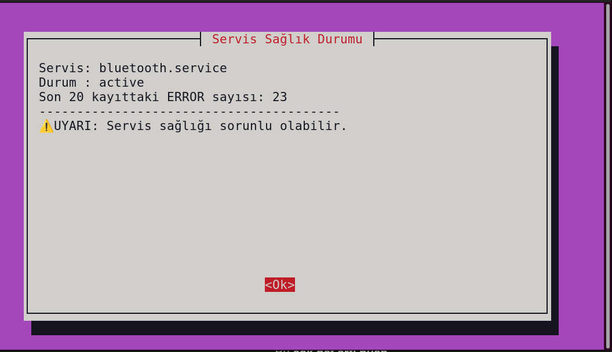
---

###  TUI - Çıkış

**Açıklama:**
Bu seçenek ile uygulama güvenli bir şekilde sonlandırılır.

---

##  Kullanılan Teknolojiler

* **Bash Script**
* **systemctl** (systemd)
* **YAD (GUI)**
* **dialog / whiptail (TUI)**
* Linux (Debian tabanlı sistemler)

---

##  Kurulum Talimatları

Aşağıdaki adımlar, projenin temiz bir Linux sistemde çalıştırılması için izlenmelidir.

###  Proje Dosyalarının Hazırlanması

Proje dosyaları aynı dizin altında bulunmalıdır:

```
proje/
├── core.sh
├── gui.sh
├── tui.sh
└── README.md
```

### Çalıştırma İzinlerinin Verilmesi

Terminal üzerinden proje dizinine girilerek aşağıdaki komutlar çalıştırılmalıdır:

```bash
chmod +x core.sh gui.sh tui.sh
```

### Gerekli Paketlerin Kurulması

#### GUI için gerekli paketler:

```bash
sudo apt update
sudo apt install yad
```

#### TUI için gerekli paketler:

```bash
sudo apt install dialog
```

> Not: `whiptail` çoğu sistemde varsayılan olarak yüklüdür.

---

## Sistem Gereksinimleri

### Minimum Gereksinimler

* Linux işletim sistemi (systemd kullanan)
* Bash Shell
* systemctl komutunun erişilebilir olması

### Önerilen Gereksinimler

* Debian tabanlı Linux dağıtımı (Ubuntu, Pardus vb.)
* Grafik arayüz (GUI kullanımı için)
* sudo veya pkexec yetkisi (servis yönetimi işlemleri için)

---

## Yetkilendirme ve Güvenlik

* Servis durumu görüntüleme işlemleri normal kullanıcı ile çalışır
* Servis başlatma/durdurma işlemleri için **sudo / pkexec** kullanılabilir
* Kullanıcıdan açıkça servis adı talep edilir

---

## Özgünlük ve Katma Değer

* Aynı çekirdek mantığıyla **çift arayüz (GUI + TUI)**
* Linux sistem yönetimini sadeleştiren frontend yaklaşımı
* Eğitim ve öğretim amaçlı kullanılabilir yapı
* Genişletilebilir mimari (cron, disk/ram bilgisi eklenebilir)

---

## Örnek Çalıştırma Youtube Videsu Linki

https://youtu.be/rnYXhdTajU8

---


